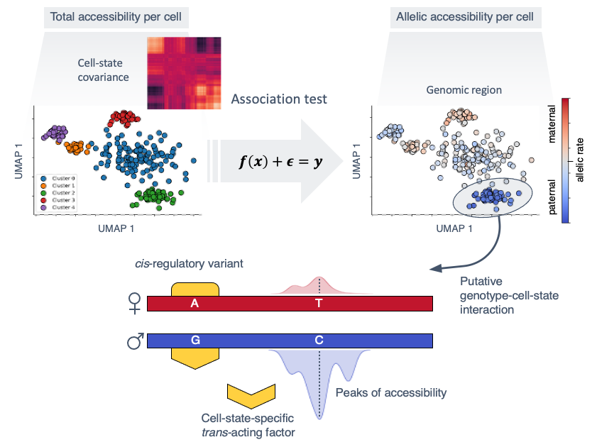

# scDALI - Discovering allelic imbalance in single-cells

**scDALI** (single-cell differential allelic imbalance) is a statistical framework for detecting allelic imbalance from
single-cell sequencing data.

## Install scDALI
To install the latest version from GitHub, you can use `pip`:
```bash
pip install git+https://github.com/PMBio/scdali
```

## Overview
**scDALI** is intended for the application to single-cell sequencing data such as transcriptome (scRNA-seq) or open-chromatin (e.g. scATAC-seq) measurements. At the core is a Beta-Binomial generalized linear mixed-effects model, capturing allelic ratios as a function of the cell state while accounting for Binomial variance and residual overdispersion. Here, *cell states* are usually defined based on the total (non-allele-specific) signal. Depending on the application, a suitable cell-state definition could be

- the position along a (pseudo-) temporal trajectory
- the cell cluster / cell type
- the coordinates in a lower dimensional-embedding, such as PCA or UMAP

scDALI implements three different tests:
- scDALI-Het - test for heterogeneous (cell-state-specific) allelic imbalance
- scDALI-Hom - test for homogeneous allelic imbalance
- scDALI-Joint - test for either kind of allelic imbalance

In addition DALI the package includes methods for approximationg the DALI generative model
and estimate allelic rates for per cell. These estimates can be used for downstream analyses,
such as visualization of variable regions and effect size determination.

## Examples
Check out the example [Jupyter notebook](https://github.com/tohein/dali/blob/main/examples/dali_example.ipynb), highlighting key features.

## Background
Allelic imbalance can be a proxy for *genetic effects*. Significantly variable genes or regions as identified by **scDALI** can be indicative of cell-state-genotype interactions. In addition to differential *total* gene expression or chromatin accessibility, heterogeneous allelic imbalance therefore provides an orthgonal view of cell-state-specific regulation.



